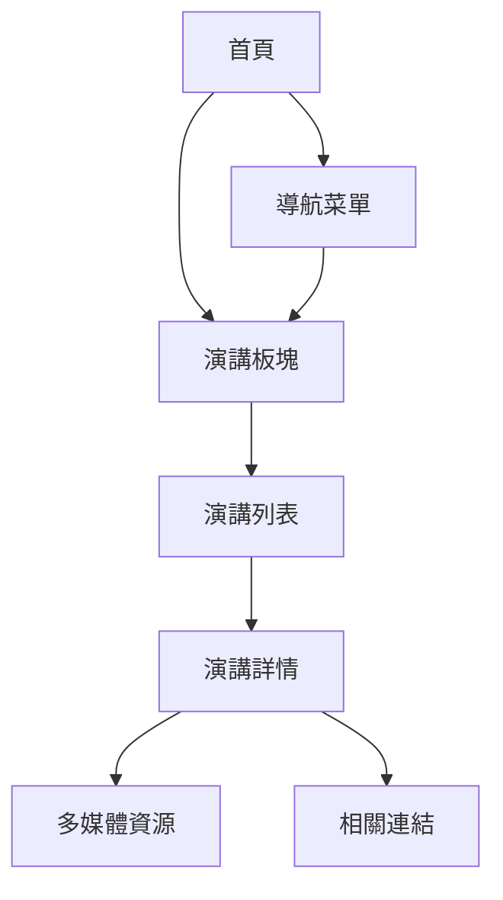

# Hugo學術網站演講板塊添加指南

## 1. 產品概述

本指南旨在為您的Hugo學術網站添加一個專門的演講板塊，用於展示個人演講、講座和分享活動。與現有的「會議」板塊（學術會議參與記錄）不同，演講板塊將專注於您作為主講人的演講活動。

## 2. 核心功能

### 2.1 用戶角色

| 角色 | 訪問方式 | 核心權限 |
|------|----------|----------|
| 網站訪客 | 直接訪問 | 瀏覽演講列表、查看演講詳情 |
| 網站管理員 | 內容管理 | 添加、編輯、刪除演講內容 |

### 2.2 功能模組

我們的演講板塊包含以下主要頁面：
1. **演講列表頁面**：展示所有演講的概覽，包括篩選和排序功能
2. **演講詳情頁面**：單個演講的完整信息展示
3. **首頁演講區塊**：在主頁展示精選或最新演講

### 2.3 頁面詳情

| 頁面名稱 | 模組名稱 | 功能描述 |
|----------|----------|----------|
| 演講列表頁面 | 演講卡片列表 | 顯示演講標題、日期、地點、簡介；支援按日期排序和標籤篩選 |
| 演講列表頁面 | 搜索和篩選 | 提供關鍵字搜索、標籤篩選、日期範圍篩選功能 |
| 演講詳情頁面 | 演講基本信息 | 展示演講標題、日期、時間、地點、主辦方等基本信息 |
| 演講詳情頁面 | 演講內容 | 顯示演講摘要、詳細描述、相關資源連結 |
| 演講詳情頁面 | 多媒體資源 | 嵌入演講影片、投影片、相關圖片 |
| 首頁演講區塊 | 精選演講展示 | 在首頁展示最新或重要演講的摘要信息 |

## 3. 核心流程

### 訪客瀏覽流程
1. 訪客從首頁或導航菜單進入演講板塊
2. 瀏覽演講列表，可使用篩選和搜索功能
3. 點擊感興趣的演講查看詳細信息
4. 在詳情頁面查看演講內容、下載資源或觀看影片

### 管理員內容管理流程
1. 創建新的演講內容文件
2. 填寫演講的基本信息和詳細內容
3. 上傳相關多媒體資源
4. 發布內容並在網站上展示



## 4. 用戶界面設計

### 4.1 設計風格
- **主色調**：沿用網站現有的emerald主題色彩
- **卡片樣式**：採用圓角卡片設計，與現有publication和project保持一致
- **字體**：使用系統默認字體，標題使用較大字號突出重點
- **佈局風格**：響應式網格佈局，支援桌面和移動設備
- **圖標風格**：使用簡潔的線性圖標，如日曆、地點、影片等

### 4.2 頁面設計概覽

| 頁面名稱 | 模組名稱 | UI元素 |
|----------|----------|--------|
| 演講列表頁面 | 頁面標題 | 大標題「我的演講」，副標題說明，emerald色彩強調 |
| 演講列表頁面 | 演講卡片 | 白色背景卡片，包含縮略圖、標題、日期、地點、標籤 |
| 演講列表頁面 | 篩選工具 | 頂部篩選欄，包含搜索框、標籤選擇器、日期選擇器 |
| 演講詳情頁面 | 標題區域 | 大標題、日期時間、地點信息，使用emerald色彩點綴 |
| 演講詳情頁面 | 內容區域 | 清晰的段落結構，適當的行間距，重點信息高亮 |
| 演講詳情頁面 | 資源區域 | 按鈕樣式的連結，支援投影片、影片、相關資料下載 |

### 4.3 響應式設計
- **桌面優先**：主要針對桌面瀏覽器優化
- **移動適配**：在平板和手機上自動調整佈局
- **觸控優化**：按鈕和連結具有適當的觸控區域大小

## 5. 實施步驟

### 步驟1：創建演講內容目錄結構
```bash
mkdir -p content/talk
```

### 步驟2：創建演講板塊索引頁面
創建 `content/talk/_index.md`：
```yaml
---
title: 我的演講
cms_exclude: true
view: card
image:
  caption: ''
  filename: ''
---
```

### 步驟3：更新導航菜單
修改 `config/_default/menus.yaml`，添加演講菜單項：
```yaml
- name: 演講
  url: '/talk/'
  weight: 35
```

### 步驟4：在首頁添加演講區塊
修改 `content/_index.md`，在適當位置添加：
```yaml
- block: collection
  id: talks-section
  content:
    title: 近期演講
    filters:
      folders:
        - talk
    count: 3
  design:
    view: compact
    columns: 1
```

### 步驟5：創建演講內容模板
每個演講創建一個文件夾，如 `content/talk/ai-in-politics-2024/index.md`：
```yaml
---
title: "生成式AI在政治工作中的應用與挑戰"

event: "台灣政治學會年會"
event_url: "https://example.org"

location: "台灣大學社會科學院"
address:
  street: "徐州路21號"
  city: "台北市"
  region: "中正區"
  postcode: '100'
  country: "台灣"

summary: "探討生成式AI技術在政治工作領域的應用現況與未來挑戰"
abstract: "本次演講將分享我在碩士論文研究中的發現..."

date: '2024-03-15T14:00:00+08:00'
date_end: '2024-03-15T15:30:00+08:00'
all_day: false

publishDate: '2024-03-01T00:00:00+08:00'

authors:
  - admin

tags:
  - 人工智慧
  - 政治工作
  - 生成式AI

featured: true

image:
  caption: '演講現場照片'
  focal_point: Right

links:
  - type: slides
    name: 投影片
    url: "slides.pdf"
  - type: video
    name: 演講錄影
    url: "https://youtube.com/watch?v=example"
  - type: code
    name: 相關資料
    url: "https://github.com/example"

slides: ""

projects:
  - ai-politics-research
---

## 演講內容概要

本次演講主要探討以下幾個面向：

### 1. 生成式AI技術概述
- ChatGPT、Claude等工具的特點
- 在文本生成、資料分析方面的能力

### 2. 政治工作應用場景
- 政策研究與分析
- 公文撰寫輔助
- 民意調查數據處理

### 3. 挑戰與限制
- 資訊準確性問題
- 隱私與安全考量
- 倫理與責任議題

## 相關資源

- [演講投影片下載](slides.pdf)
- [研究論文連結](../publication/master-thesis-ai-behavior/)
- [相關專案](../project/ai-politics-research/)
```

### 步驟6：測試和優化
1. 啟動Hugo開發服務器測試顯示效果
2. 檢查響應式設計在不同設備上的表現
3. 優化SEO設置和社交媒體分享功能
4. 根據需要調整樣式和佈局

## 6. 與現有「會議」板塊的區別

| 特點 | 會議板塊 (event) | 演講板塊 (talk) |
|------|------------------|------------------|
| 主要用途 | 學術會議參與記錄 | 個人演講活動展示 |
| 角色定位 | 參與者/發表者 | 主講人/分享者 |
| 內容重點 | 會議論文、學術交流 | 演講主題、知識分享 |
| 目標受眾 | 學術同行 | 更廣泛的聽眾群體 |
| 展示方式 | 學術格式 | 更加親民和易懂 |

## 7. 後續維護建議

1. **定期更新**：及時添加新的演講內容
2. **多媒體豐富**：盡可能添加演講錄影、投影片等資源
3. **SEO優化**：為每個演講頁面設置適當的meta描述和關鍵字
4. **社交分享**：確保演講內容易於在社交媒體上分享
5. **分析追蹤**：使用Google Analytics等工具追蹤演講頁面的訪問情況

通過以上步驟，您可以成功為網站添加一個專業且功能完整的演講板塊，有效展示您的演講活動和專業影響力。