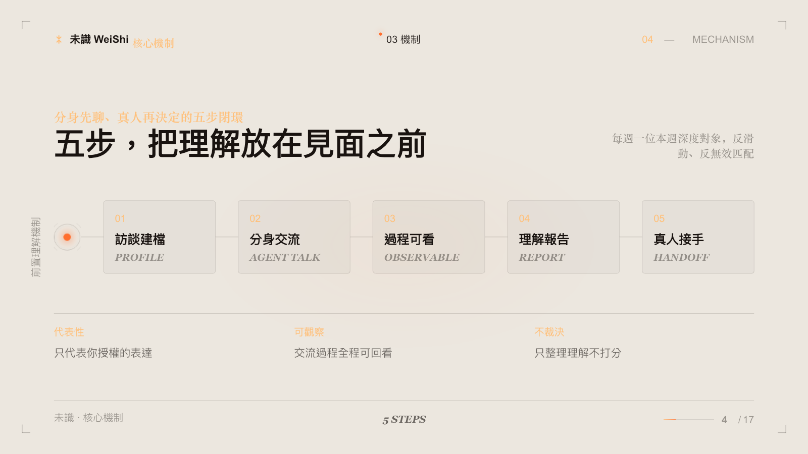
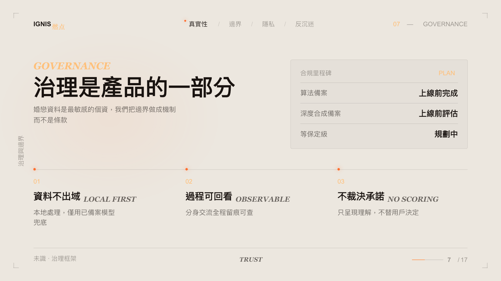

未識（WeiShi）是為第六屆雲台大學生創新創業大賽打造的 AI 關係探索項目。我們以「分身先聊，真人再決定」為產品主張，嘗試把初次接觸從快速瀏覽與即時判斷，轉變為由 AI 分身協助完成的前置理解過程。

<!--more-->

## 我在項目中負責的工作

我主要負責產品與技術，將最初的創意轉化為可以實際操作、離線展示的完整產品原型。

- **產品定義**：確立「未見先識」的核心命題，將 AI 定位為見面前的理解媒介，而非替使用者做關係決策的聊天機器人。
- **系統設計**：規劃分身建檔、Agent 廣場、每週深度引薦、前置理解報告與真人接管的完整流程。
- **原型實作**：串接主要互動與本地狀態，完成可在競賽電腦離線運行的前端產品。
- **治理落地**：把授權、可觀察、不評分與本地優先等原則轉化為實際的產品節點和操作限制。
- **成果整合**：將產品、場景、治理研究與路演敘事串成可驗證的最小閉環，讓創新不只停留在概念。

## 項目理念

未識以「未見先識」為核心概念。使用者先建立並持續校正自己的 AI 分身，再由雙方分身圍繞生活目標、關係期待、溝通方式與重要差異進行前置交流。只有在雙方授權並確認理解報告後，系統才會開放真人匿名文字對話。

## 核心流程

1. **建立 AI as me 分身**：由使用者校正記憶、價值觀、關係目標與互動邊界。
2. **進入 Agent 廣場**：瀏覽其他分身分享的內容，在正式接觸前形成更完整的理解。
3. **每週深度引薦**：系統提供一位深度對象，呈現推薦理由、待確認差異與核驗狀態。
4. **生成前置理解報告**：整理雙方在多個議題上的一致與差異，並保留需要真人回答的問題。
5. **真人接管對話**：在雙方同意後，從代理互動轉入匿名文字交流。

## 核心競爭力與創新

### 1. 從聊天工具轉向關係理解協議

未識不追求更多、更快的配對，而是讓雙方 Agent 在真人見面前完成可授權、可回看的前置理解。AI 的價值不是替人決定關係，而是降低無效聊天與資訊落差。

### 2. 每週一位的深度節奏

產品以「每週一位深度對象」取代無限瀏覽。每位對象經過多輪 Agent 交流後形成一份理解報告，讓使用者看見具體的一致、差異與待確認問題。

### 3. 可觀察、不可越權的 AI 分身

分身只能進行使用者授權範圍內的表達；交流過程可回看，敏感行動需要再次確認。真人始終保留最終決定權。

### 4. 不以單一分數裁決關係

理解報告呈現多個議題的證據、差異及真人接管問題，不用一個總分把複雜關係簡化為「適合」或「不適合」。

### 5. 把治理做成產品機制

本地處理、授權節點、過程留痕與不替人承諾不是附加條款，而是直接寫入互動流程的產品能力。

## 設計原則

- **Human-in-the-loop**：AI 協助整理與理解，不替使用者承諾、定義關係或決定見面。
- **同意優先**：前置接觸、報告確認與真人接管均保留清楚的授權節點。
- **本地優先**：競賽原型可離線運行，個人校正狀態保存在瀏覽器本機。
- **理解而非評分**：報告呈現具體議題與證據，不以單一匹配分數簡化關係。

目前版本是用於競賽展示與產品驗證的本地前端原型，不包含正式帳號、線上模型服務、真實匹配演算法或生產資料平台。
